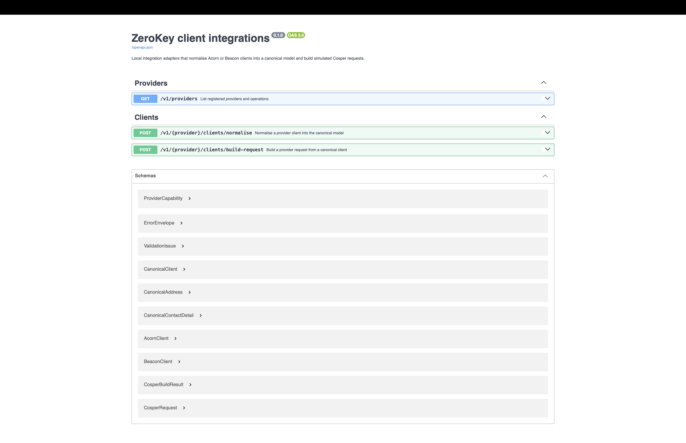

# ZeroKey client integrations

A local, backend-only integration slice: **Acorn or Beacon → canonical Client → Cosper**.
It implements the seven core requirements from the take-home exercise. The providers and
sample clients are fictional. Cosper responses are simulations; no external provider is called.

The [requirement coverage](#requirement-coverage) maps the approved scope to code and tests.
Completed stretch goals are [resilience](#api-resilience), [round-trip consistency](#round-trip-consistency),
[nationality normalisation](#nationality-normalisation) and
[capability/versioning awareness](#canonical-versioning-and-capability-discovery), plus
[OpenAPI/Swagger tooling](#openapi-and-swagger).

## Quick start

Prerequisite: Node 24.21.0 and npm 12.0.2. If you use nvm, run `nvm install && nvm use` first.

```sh
# Terminal 1 — from the repository root
npm ci
# Installs the repository-owned pre-commit and pre-push QA gates automatically.
npm run dev

# Terminal 2 — confirm the service is running
curl --fail-with-body -sS http://127.0.0.1:3000/v1/providers
```

Normalise a supplied fixture:

```sh
curl --fail-with-body -sS \
  -H 'Content-Type: application/json' \
  --data-binary @fixtures/acorn-client.json \
  http://127.0.0.1:3000/v1/acorn/clients/normalise
```

Run the complete automated check suite:

```sh
npm run check
```

## Detailed setup

Use **Node 24.21.0 LTS** and **npm 12.0.2**. The Node version is recorded in `.nvmrc`;
if you use nvm, run `nvm install && nvm use`. Otherwise install that Node LTS release
using your preferred Node installation method. No database, credentials or environment file
is needed.

```sh
npm ci
npm run dev
```

`npm install && npm run dev` also works. `npm ci` is preferred for reproducing the lockfile.
Its `prepare` step installs the repository-owned hooks automatically. The installer affects only
this repository and refuses to overwrite another hooks path. If you installed dependencies with
`--ignore-scripts`, run `npm run hooks:install` once instead.

The service listens at **http://127.0.0.1:3000**. Override the port with `PORT=3001 npm run dev`.
An invalid or occupied port fails clearly; the service never stops another process. Stop with
Ctrl-C. SIGINT/SIGTERM trigger graceful shutdown with a five-second deadline.

To run compiled JavaScript:

```sh
npm run build
npm start
```

The app uses TypeScript 7, Hono 4, Zod 4 and Vitest 5. Direct dependencies are pinned.
Biome handles formatting/linting; tsx is only the development runner. npm 12's install-script
policy permits the reviewed esbuild version and denies optional fsevents scripts; no blanket
script approval is required.

## Exercise the API

Run these commands from the repository root in a second terminal:

```sh
ZEROKEY_URL=http://127.0.0.1:3000

curl --fail-with-body -sS "$ZEROKEY_URL/v1/providers"

curl --fail-with-body -sS \
  -H 'Content-Type: application/json' \
  --data-binary @fixtures/acorn-client.json \
  "$ZEROKEY_URL/v1/acorn/clients/normalise"

curl --fail-with-body -sS \
  -H 'Content-Type: application/json' \
  --data-binary @fixtures/beacon-client.json \
  "$ZEROKEY_URL/v1/beacon/clients/normalise"
```

Drive Acorn → canonical → Cosper without constructing the canonical body by hand:

```sh
set -o pipefail
curl --fail-with-body -sS \
  -H 'Content-Type: application/json' \
  --data-binary @fixtures/acorn-client.json \
  "$ZEROKEY_URL/v1/acorn/clients/normalise" |
curl --fail-with-body -sS \
  -H 'Content-Type: application/json' \
  --data-binary @- \
  "$ZEROKEY_URL/v1/cosper/clients/build-request"
```

The final response has this envelope; `request` contains the complete generated body:

```json
{
  "request": {
    "ClientRef": "90210",
    "Forename": "Priya",
    "Surname": "Chandra-Bose",
    "DateOfBirth": "02/07/1985",
    "Sex": 1,
    "MaritalStatus": 3,
    "AddressLine1": "Flat 4",
    "AddressLine2": "12 Vereker Road",
    "Town": "London",
    "Postcode": "W14 9JR",
    "Country": "United Kingdom",
    "Email": "priya.cb@example.co.uk",
    "Telephone": "+44 7700 900123"
  },
  "response": {
    "status": "created",
    "clientRef": "90210",
    "simulated": true
  }
}
```

`GET /v1/providers` returns registered slugs, their supported operations and the canonical model
version that those operations consume or produce. Both POST routes return 200 on success.
`build-request` consumes a canonical client directly, not an envelope.

An example validation failure:

```sh
curl -i -sS -H 'Content-Type: application/json' \
  --data '{"id":90210,"person":{"dateOfBirth":"2025-02-29"}}' \
  "$ZEROKEY_URL/v1/acorn/clients/normalise"
```

Expect HTTP 422 and an error containing `code`, `message`, `requestId` and `issues` with
source paths such as `["person", "dateOfBirth"]`. Request IDs are generated by the server
and also returned in `X-Request-Id`. Errors never echo rejected values or stack traces.

| Failure | Status | Error code |
| --- | --- | --- |
| Unknown provider | 404 | `unknown_provider` |
| Unmatched route | 404 | `not_found` |
| Unsupported provider operation | 400 | `unsupported_operation` |
| Malformed/empty JSON | 400 | `invalid_json` |
| Body over 1 MiB | 413 | `payload_too_large` |
| Missing/non-JSON content type | 415 | `unsupported_media_type` |
| Invalid caller data | 422 | `validation_failed` |
| Unexpected failure or invalid generated output | 500 | `internal_error` |

Provider and operation checks happen before body parsing. `application/json` with charset
parameters is supported. Unexpected failures log only a safe event and correlation context,
not payloads, NI numbers, contact details, exception text or credentials.

## Model and architectural boundaries

```text
src/domain       Canonical runtime schemas and inferred types
src/providers    Separate raw schemas and mappings for each provider
src/shared       Small normalisation, country and validation helpers
src/registry     Typed adapter contract and composition/dispatch
src/http         Hono application, configuration and local listener
src/server.ts    Process startup and shutdown
tests            Independent unit, API and real-server smoke suites
fixtures         Unchanged exercise JSON inputs and expected Cosper request
```

The canonical model keeps the brief's field names and enums. Zod is the single source of truth
for runtime validation and TypeScript types: no parallel, manually synchronised interfaces.
The domain does not import provider models or HTTP code. Provider-specific representations
are handled at the edges; routes never switch on `acorn`, `beacon` or `cosper`.

Provider input starts as `unknown`. Each adapter validates the fields it understands and
discards unrelated extra fields. Canonical input is stricter: unknown properties are rejected,
nullable fields must be present, and collections must be arrays. Only omitted marital status
defaults to `unknown`; explicit null marital status is invalid. Generated output is validated
too, but a defect in our generated output is a 500, not a caller's 422.

Every successful canonical client explicitly contains `"schema_version": "v1"`. This is the
canonical-model version, distinct from the `/v1` HTTP route prefix, the application release
number and OpenAPI's version. `build-request` also accepts an otherwise valid legacy canonical
client with no `schema_version`, supplying `v1` at that boundary only. Other values are rejected
with the usual safe 422 response. New normalisers must always produce the field; its absence is
an internal 500 rather than a silently repaired adapter defect.

This distinction makes missing data explicit without equating it with bad data. Optional
provider text that is missing, null or blank becomes null; missing/null collections become
empty arrays. Wrong types and non-empty malformed dates/known contacts fail atomically.
Unknown marital labels safely become `unknown`, unknown gender labels become null, and
unknown contact channels become `other`. Empty contacts and entirely empty addresses are omitted.

IDs remain source IDs. We do not infer that matching names identify the same global client.
The two supplied canonical results therefore legitimately differ in ID, Acorn's secondary email
and its move-in date. `consistency.test.ts` normalises both original fixtures and strictly
compares their shared canonical fields against an independently authored expectation.

## Mapping decisions and limits

- **Names:** trim/collapse whitespace, preserve Unicode and punctuation; compose full name
  from first/middle/last, without title or empty separators.
- **Dates:** real calendar dates, years 0001–9999. Acorn uses ISO; Beacon uses exact
  DD/MM/YYYY; Cosper receives DD/MM/YYYY. No timezone conversion or inferred age restrictions.
- **NI:** uppercase and remove whitespace. This does not validate issuance; the fictional QQ
  number in the brief is intentionally accepted.
- **Enums:** explicit complete tables implement the brief, including `Living Together`,
  `Intend to Marry`, `Civil Partnership`, `Unspecified` and `Non-Binary`. Labels are trimmed
  and case-folded. No sex is inferred from a title or name.
- **Beacon bags:** unknown keys are ignored; duplicate recognised keys are rejected with their
  source index. Boolean strings are parsed explicitly, so `"false"` never becomes true.
- **Address layout:** Acorn's first non-empty building/street/locality component becomes line1;
  the rest form line2. Beacon line1 is split at its first comma only if line2 is absent.
  Remaining content is retained; this is a bounded provider convention, not a postal parser.
- **Countries:** the shared lookup supports GB, IE, FR, DE, US, CA, AU and NZ, their alpha-3
  codes and English names. Unknown inbound countries become null. Canonical syntax permits
  uppercase two-letter codes; an unsupported selected non-null Cosper country produces a
  `422` issue with code `unsupported_country`, rather than an invented country name.
- **Nationality:** canonical nationality is one of the same eight alpha-2 codes or null.
  Country names/codes and the documented demonyms, including `British`, normalise through a
  bounded lookup. Unsupported values become null. Acorn rejects two recognised, contradictory
  nationality fields with field-level `conflicting_nationality` errors. Nationality is never
  inferred from residence.
- **Phones:** recognised phones use compact international form. Explicit `+`/`00` prefixes
  and presentation separators are supported. These fictional adapters assume GB for an
  11-digit local number beginning with 0; non-UK callers must supply an international prefix.
  Unsupported formats fail. This is not complete global number-plan validation.
- **Contacts:** preserve order, primary flags and secondary values. Email case is retained.
  Email/phone format checks do not perform network validation or prove ownership.

### Cosper's lossy boundary

`engaged` becomes marital code **0 (unknown)** because engagement does not establish a supported
status. Null legal sex becomes **2**, the same code Cosper provides for other/unspecified.
All remaining enum codes follow the brief. Optional output strings are explicit nulls—an
assumption for this fictional API.

Choose the first usable primary address, otherwise the first usable address. A county-only
or move-in-only address is retained canonically but cannot supply a Cosper address.

Choose the first primary email, otherwise the first email. For phones, primary status wins
first, then mobile before telephone, then original order. Without primaries, use the first
mobile, otherwise telephone. Never reinterpret `other` as a phone. UK mobiles receive the
fixture's `+44 7700 900123` presentation; other international numbers remain compact.

Cosper drops title, middle names, nationality, county, extra addresses and secondary contacts,
and collapses enum distinctions. This is deliberately not described as a lossless round trip.

See [the full contract](docs/challenge-contract.md) and [decision history](docs/decisions.md).
Recorded local checks and acceptance evidence are in [verification](docs/verification.md).

## Add a provider

1. Add its raw Zod schema and mapping module under `src/providers/<slug>`.
2. Expose `normalise(raw: unknown)` and/or `buildRequest(client: CanonicalClient)` satisfying
   `ProviderAdapter` from the registry module. Validate raw input and generated output.
3. Register its slug and methods in `src/registry/providers.ts`.
4. Add independent mapping/edge tests and run `npm run check`.

No HTTP route changes are needed. The registry derives capabilities, rejects duplicate or
invalid slugs, non-function operations and providers with no operations. It snapshots
registrations and does not expose mutable internal lists. The test-only Delta adapter proves
both operations can be added by registration alone while retaining exact concrete request types.

## Test and review

Run commands from the repository root. These are the observed passing results on
**11 September 2026**, using **Node 24.21.0 / npm 12.0.2**:

| Test folder / selection | Command | Passing result |
| --- | --- | --- |
| `tests/unit/` — model, mappings, registry, configuration and validation | `npm run test:unit` | 246 tests across 8 files |
| `tests/api/` — HTTP contracts, extensibility and resilience | `npm run test:api` | 216 tests across 3 files |
| API resilience matrix only (included in API total) | `npm run test:resilience` | 195 tests |
| `tests/smoke/` — real HTTP and compiled-server checks | `npm run test:smoke` | 22 tests across 2 files |
| All unit/API tests together | `npm test` | 462 tests |

**484 distinct tests pass across the three test folders.** Resilience is a subset of the API
total; coverage reruns the unit/API suite and must not be counted as additional distinct tests.
`tests/helpers/` contains shared fixtures/assertions rather than a separate test suite.

To list every individual test name while running a folder, append `-- --reporter=verbose`:

```sh
npm run test:unit -- --reporter=verbose
npm run test:api -- --reporter=verbose
npm run test:smoke -- --reporter=verbose
```

To run one file, append its path, for example
`npm run test:unit -- tests/unit/consistency.test.ts` or
`npm run test:smoke -- tests/smoke/resilience.test.ts`.

<details>
<summary>Passing test-file inventory</summary>

| Folder | Test file | Passed |
| --- | --- | --- |
| `tests/unit/` | `client.test.ts` | 52 |
| `tests/unit/` | `config.test.ts` | 10 |
| `tests/unit/` | `consistency.test.ts` | 2 |
| `tests/unit/` | `cosper.test.ts` | 39 |
| `tests/unit/` | `countries.test.ts` | 17 |
| `tests/unit/` | `inbound.test.ts` | 115 |
| `tests/unit/` | `registry.test.ts` | 4 |
| `tests/unit/` | `validation.test.ts` | 7 |
| `tests/api/` | `app.test.ts` | 19 |
| `tests/api/` | `extensibility.test.ts` | 2 |
| `tests/api/` | `resilience.test.ts` | 195 |
| `tests/smoke/` | `server.test.ts` | 6 |
| `tests/smoke/` | `resilience.test.ts` | 16 |

</details>

Additional QA commands:

```sh
npm run check:fast
npm run typecheck
npm run lint
npm run format:check
npm run coverage
npm run check
```

`check:fast` runs strict type checks, formatting/lint checks and the unit/API suite. It is the
pre-commit gate, keeping feedback fast while still rejecting invalid source. `check` adds
coverage thresholds, the production build, compiled-server smoke tests and
`npm audit --audit-level=high`; it is enforced before every push and in GitHub CI. Do not bypass
hooks. Use `npm run lint:fix` or `npm run format` for local formatting fixes, then run the checks
again.

Tests assert complete fixture outputs plus every listed enum, missing/bad data, calendar
boundaries, source paths, primary-selection precedence, input immutability, extension behaviour
and safe error responses/logging. Smoke tests bind real loopback ports, run the compiled entry
point, check actual UTF-8 body limits and verify configuration/port errors and both shutdown signals.

All source files appear in coverage reporting. Domain/provider/shared transformations must
reach 90% lines/statements/functions and 85% branches as a group. Coverage is not a claim of
correctness: the compiled entry point runs in a separate process and is not counted by the
unit/API coverage report. No source files are hidden with coverage exclusions.

Vitest 5.0.0 currently ships conflicting third-party declarations. The test-inclusive compiler
skips checking declaration bodies only; our source and tests remain strictly checked, including
their use of library types. A separate production compiler also checks dependency declarations.
See the concrete compatibility notes in the decision history. No `any` escapes or source
type-error suppressions are used to make application checks pass.

## Requirement coverage

Approved implementation scope: all seven core requirements, resilience, round-trip consistency,
nationality normalisation, capability/versioning awareness and tooling/ergonomics stretch goals.
The tables distinguish completed work from deferred optional work. Numbers below follow the
exercise brief's order, rather than implementation priority.

### Core requirements — approved and implemented

| Core requirement | Implementation / deliverable | Verification |
| --- | --- | --- |
| 1. Canonical model, types and runtime validation | [Canonical Zod schemas and inferred types](src/domain/client.ts) | [Schema and type tests](tests/unit/client.test.ts), `npm run typecheck` |
| 2. Two inbound adapters | [Acorn](src/providers/acorn/normalise.ts), [Beacon](src/providers/beacon/normalise.ts), [normalisation helpers](src/shared/normalisation.ts) | [Fixtures, enums, dates and missing data](tests/unit/inbound.test.ts), [validation paths](tests/unit/validation.test.ts) |
| 3. Cosper outbound adapter | [Request builder](src/providers/cosper/build-request.ts), [destination schema](src/providers/cosper/schema.ts) | [Exact target, encodings and contact selection](tests/unit/cosper.test.ts) |
| 4. Hono API and structured errors | [HTTP application](src/http/app.ts), [validation errors](src/shared/validation.ts) | [API contracts and errors](tests/api/app.test.ts), [real-server smoke tests](tests/smoke/server.test.ts) |
| 5. Extensible architecture | [Registry](src/registry/registry.ts), [provider registration](src/registry/providers.ts) | [Registry tests](tests/unit/registry.test.ts), [fourth-provider proof](tests/api/extensibility.test.ts) |
| 6. Meaningful tests | [Test suites](tests), [coverage gates](vitest.config.ts), [QA scripts](package.json) | `npm run check`; [recorded evidence](docs/verification.md) |
| 7. README and runnable examples | [Quick start](#quick-start), [API examples](#exercise-the-api), [model boundaries](#model-and-architectural-boundaries), [mapping decisions](#mapping-decisions-and-limits), [add a provider](#add-a-provider), [OpenAPI/Swagger](#openapi-and-swagger) | [Installation and API exercise evidence](docs/verification.md) |

### Stretch goals — completion status

| Stretch goal | Status and coverage | Code / evidence |
| --- | --- | --- |
| 1. Resilience | **Approved and implemented:** all supported POST endpoints have malformed/partial-data, size-limit and fault coverage; discovery/output defects and non-Error throws return safe responses; subsequent requests recover. | [API matrix](tests/api/resilience.test.ts), [real HTTP failure/recovery](tests/smoke/resilience.test.ts), [shared failure boundary](src/http/app.ts) |
| 2. Round-trip consistency | **Approved and implemented:** directly compare both samples' shared canonical data and preserve legitimate differences. | [Dedicated consistency suite](tests/unit/consistency.test.ts), [explanation below](#round-trip-consistency) |
| 3. Nationality / country normalisation | **Approved and implemented:** country names/codes and documented nationality labels produce a bounded alpha-2 nationality code. | [Catalogue and canonical schema](src/domain/countries.ts), [normalisation helper](src/shared/countries.ts), [mapping tests](tests/unit/countries.test.ts) |
| 4. Second resource end-to-end | **Not started.** Client is the only resource. | [Current resource contract](src/domain/client.ts) |
| 5. Capability / versioning awareness | **Approved and implemented:** the registry derives operations from actual adapter methods and reports an explicit canonical `v1`; every normalised client declares `schema_version: "v1"`. | [Versioned canonical schemas](src/domain/client.ts), [capability registry](src/registry/registry.ts), [API/extension tests](tests/api/app.test.ts) |
| 6. Tooling & ergonomics | **Approved and implemented:** repository hooks, shared QA commands, CI, safe structured logging and source-derived OpenAPI/Swagger documentation. | [OpenAPI contract](src/http/openapi.ts), [hook installer](scripts/install-hooks.mjs), [QA scripts](package.json), [CI](.github/workflows/qa.yml) |

## API resilience

Run `npm run test:resilience` for the focused 195-case API matrix, or `npm run test:smoke`
for real HTTP and compiled-server verification. The matrix covers Acorn normalisation,
Beacon normalisation, Cosper request building, provider discovery, OpenAPI and Swagger routes.

Supported partial provider records return 200 with deliberate nulls, empty collections and
documented enum defaults. Invalid known fields fail atomically with 422 and original field
paths; transport errors retain their documented 400/413/415 responses. Normalisation and
build operations remain synchronous; no external provider calls or retry policy are introduced.

Unexpected exceptions and invalid generated data return a generic 500. A shared boundary also
catches non-Error JavaScript throws, such as strings or null, which otherwise escape Hono's
Error-only handler. One correlated logging attempt contains only safe operational fields,
even when the log sink itself fails. Tests assert privacy, request-ID isolation and successful
requests immediately following failures on the same application/server.

Body limits are verified at one byte below, exactly at, and one byte above 1 MiB, with UTF-8
data and accurate or absent Content-Length headers. Smoke tests also send genuinely chunked
uploads. Documentation remains available when an injected provider registry fails.
This is evidence for the listed finite failure cases, not a guarantee against every possible
resource-exhaustion attack or process failure. See [verification evidence](docs/verification.md).

## Canonical versioning and capability discovery

`schema_version: "v1"` identifies the complete canonical client contract. Its nested address
and contact shapes are part of that version; it does not declare a provider API version. The
normalise routes return the field explicitly. The build route accepts the explicit v1 value or
an omitted value from a legacy v1 caller, then passes an explicit v1 client to the provider
adapter. It rejects any other version as invalid caller data.

`GET /v1/providers` is generated from the registry, rather than a hard-coded list. Each entry
contains `slug`, `supports` and `canonical_version`. Registering a provider with `normalise`,
`buildRequest`, or both automatically updates discovery and route dispatch. The API test proves
this with a fourth provider without changing any HTTP route code.

Future incompatible canonical changes require a new contract identifier such as `v2` and an
explicit compatibility policy. This implementation never interprets an unknown version as v1.
Clients that reject additional JSON response properties should update to accept
`schema_version` before consuming newly normalised responses.

Inspect the capability contract locally:

```sh
curl --fail-with-body -sS "$ZEROKEY_URL/v1/providers"

curl --fail-with-body -sS \
  -H 'Content-Type: application/json' \
  --data-binary @fixtures/acorn-client.json \
  "$ZEROKEY_URL/v1/acorn/clients/normalise"
```

## OpenAPI and Swagger

Start the service with `npm run dev`, then open the generated contract at
**[http://127.0.0.1:3000/openapi.json](http://127.0.0.1:3000/openapi.json)** or use the interactive Swagger reference at
**[http://127.0.0.1:3000/docs](http://127.0.0.1:3000/docs)**. The document is generated from the route contracts and
the same runtime Zod schemas that validate canonical and provider data. Swagger's “Try it out”
uses the current local server and the specification URL is relative, so it never targets an
external provider.

The provider path remains registry-driven rather than a fixed OpenAPI enum. The documentation
includes examples for the current Acorn, Beacon and Cosper adapters; call `GET /v1/providers`
for the authoritative runtime capability list.

### Verify the API reference locally

In the first terminal, from the repository root:

```sh
nvm install && nvm use
npm ci
npm run dev
```

Leave that server running. In a second terminal, use the exact variable name below:

```sh
export ZEROKEY_URL='http://127.0.0.1:3000'

curl --fail-with-body -sS "$ZEROKEY_URL/openapi.json"
open "$ZEROKEY_URL/docs"
```

The first command prints the generated OpenAPI JSON. The second opens the interactive local
reference in the default browser. This screenshot records a successful manual Swagger check:



## Round-trip consistency

The brief defines this stretch goal as proving that the supplied Acorn and Beacon payloads
normalise to equivalent canonical clients on their shared fields. Both production adapters were
already implemented for core 2; this stretch adds a direct, independent proof of their agreement.

Run the focused proof from the repository root:

```sh
npm test -- tests/unit/consistency.test.ts
```

The [two tests](tests/unit/consistency.test.ts) verify:

1. Both full outputs satisfy the canonical runtime schema. Their shared fields strictly equal
   each other and a hand-authored expected result: names, DOB, NI number, legal sex, marital
   status, nationality, the complete shared address and both primary contacts. Exact arrays and
   explicit nulls prevent missing data or a common wrong result from passing.
2. Legitimate differences remain intact: source IDs, Acorn's `2016-03-01` move-in date versus
   Beacon's null, and Acorn's non-primary email versus none.

The comparison helper only selects fields: it excludes the source ID, removes address
`move_in_date` and retains all primary contacts in their original order. Original fixture inputs
and canonical outputs are deeply frozen before comparison. It does not repair or normalise
values to make the comparison pass. These are fictional sample-equivalence tests, not an
identity-matching system or a claim that Cosper preserves every canonical field.

The suite runs automatically in `npm test`, the full QA gate and the existing Git hooks. See
[verification evidence](docs/verification.md#cross-provider-consistency) for measured results.

## Nationality normalisation

Nationality is a bounded canonical country code: `GB`, `IE`, `FR`, `DE`, `US`, `CA`, `AU`, `NZ`
or `null`. The shared catalogue recognises each supported country code, alpha-3 code and English
country name, plus its documented demonym. For example, `British`, `United Kingdom`, `GB` and
`GBR` all normalise to `GB`.

Unknown or compound values become null; raw values are not copied into the canonical result.
Nationality is never inferred from an address. If Acorn supplies two recognised nationality
values that resolve differently, normalisation returns a structured 422 response with a
`conflicting_nationality` issue on each original field.

Run the focused lookup and adapter tests:

```sh
npm test -- tests/unit/countries.test.ts tests/unit/inbound.test.ts
```

See [verification evidence](docs/verification.md#nationality-normalisation) for measured results.
